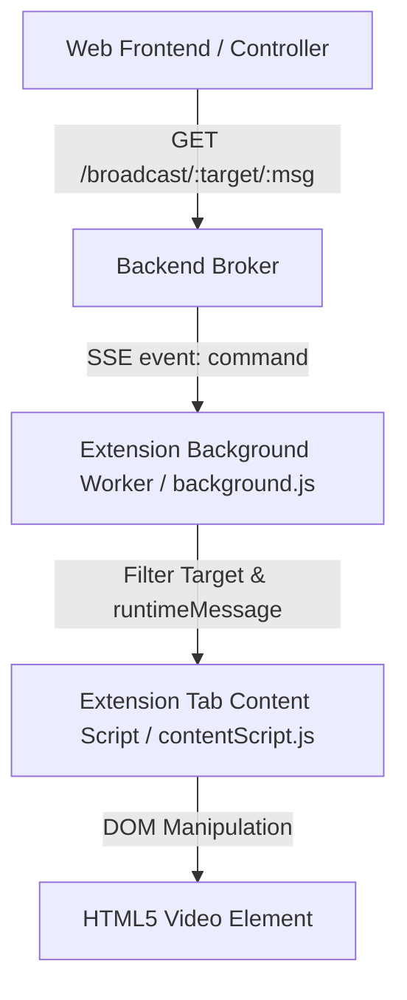

# Remote Video Control

Remote Video Control is a lightweight, self-hosted system that allows you to control video media playback on various websites (YouTube, Netflix, Prime Video, Disney+) on remote devices (such as a projector or laptop) using a simple web interface.

The system consists of three main components:
1. **Backend Broker**: A Node.js Express server that relays command events and serves the frontend statically.
2. **Web Frontend**: A mobile-friendly control panel interface with health indicators.
3. **Browser Extension**: A Chrome extension that establishes a single SSE connection to the backend and controls standard HTML5 `<video>` players on active tabs based on custom targets.

---

## Architecture Overview



### 1. Backend Broker (`backend/`)
- A Node.js Express server running on a customizable `PORT` (default `6969`).
- **SSE Connection**: Connection endpoint `/events` routes SSE stream messages (events of type `command`).
- **Health check API**: The `/status` endpoint reports the count of active connections and server timestamp.
- **Static Serving**: Hosts static frontend assets from `STATIC_DIR` (default: `./frontend`).

### 2. Web Frontend (`frontend/`)
- A clean, responsive control interface layout with controllers for target devices (**Beamer** and **Laptop**).
- **Settings configuration**: Contains a settings panel banner allowing you to input a custom backend server IP/URL. Stored locally in `localStorage`.
- **Health Indicators**: Check server connection periodically via the `/status` API, displaying a visual green (Connected) / red (Disconnected) indicator dot.

### 3. Chrome Extension (`extension/`)
- An unpacked manifest v3 extension with:
  - **permissions**: `activeTab`, `scripting`, `tabs`, `storage`, `<all_urls>`
- **Resilient background worker (`background.js`)**:
  - Connects to SSE events endpoint defined in configurations (fallback: `https://videocontrol.timsalokat.dev`).
  - Maintains **exactly one** SSE connection.
  - Implements connection status reporting, diagnostic logs, extension status updates, and automatic **exponential backoff-based reconnection**.
  - Inspects event targets (filters commands sent to specific target identity like `beamer` or `laptop`, or matches `any`).
  - Safe message pass-through `chrome.tabs.sendMessage` to active tabs.
- **Content Script (`contentScript.js`)**:
  - Injected on matched domains (Netflix, Disney+, Prime Video) or manually.
  - Decoupled from SSE; simply listens to runtime control actions from background, executing DOM queries against video elements.
- **Popup interface (`popup.html` / `popup.js`)**:
  - Customize SSE Server Endpoint and Target Client identity via Chrome Local Storage.
  - Interactive Connection status dot (Connected / Connecting / Disconnected).
  - Manual button to force-inject the control runtime onto other tabs (e.g. YouTube).

---

## Directory Structure

```
remote-video-control/
├── backend/            # Express backend files
│   ├── package.json
│   └── server.js
├── extension/          # Browser extension
│   ├── manifest.json
│   ├── background.js
│   ├── contentScript.js
│   └── popup.html/js
├── frontend/           # Web app files
│   ├── index.html
│   └── app.js
├── Dockerfile          # Root unified multi-stage build copy
└── Makefile            # Root task automator
```

---

## Setup and Installation

### Running the System

You can run the combined application (backend and frontend served together) locally or in container deployment.

#### Option 1: Local Development
Run the following root-level command:
```bash
make dev
```
This automatically installs backend Node dependencies and boots up the server on port `6969`.
Open your browser to `http://localhost:6969` to access the remote controller interface.

#### Option 2: Docker Setup
Build and start the container via the root-level commands:
```bash
# Build the unified container
make build

# Run the container (defaulting port to 6969)
make run
```
To run the server on a custom port (e.g., port `8080`):
```bash
PORT=8080 make run
```

### Loading the Browser Extension
1. Open Google Chrome.
2. Go to `chrome://extensions/`.
3. Enable **Developer mode** (top-right).
4. Click **Load unpacked** (top-left) and select the `extension/` directory.
5. Click the extension toolbar icon, set your Server URL (e.g. `http://localhost:6969` or your deployed domains) and Target client device, and click **Save**.
6. **Session Pairing**: The extension automatically generates a unique 6-character **Session ID** (which you can Click to Copy). Paste this Session ID into the Web Frontend settings panel. This establishes an isolated, temporary one-to-one session between that browser extension and that controller page. Run multiple distinct sessions for different rooms simultaneously without interference.

---

## Supported Commands

| Command | Action | Implementation |
| :--- | :--- | :--- |
| `play` | Resumes playback | `video.play()` |
| `pause` | Pauses playback | `video.pause()` |
| `skip` | Skips forward by 10s | `video.currentTime += 10` |
| `rewind` | Skips backward by 10s | `video.currentTime -= 10` |
| `mute` | Mutes audio | `video.muted = true` |
| `unmute` | Unmutes audio | `video.muted = false` |
| `volUp` | Raises volume (+0.1) | `video.volume += 0.1` |
| `volDown` | Lowers volume (-0.1) | `video.volume -= 0.1` |
| `fullscreen` | Enters full screen | `video.requestFullscreen()` |
| `smallscreen`| Exits full screen | `document.exitFullscreen()` |
