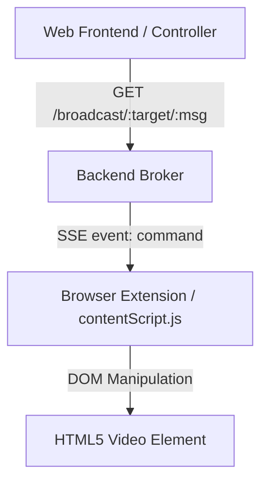

# Remote Video Control

Remote Video Control is a lightweight, self-hosted system that allows you to control video media playback on various websites (YouTube, Netflix, Prime Video, Disney+) on remote devices (such as a projector or laptop) using a simple web interface.

The system consists of three main components:
1. **Backend Broker**: A Node.js Express server that relays command events.
2. **Web Frontend**: A mobile-friendly control panel interface.
3. **Browser Extension**: A Chrome extension that connects to the backend and controls standard HTML5 `<video>` players.

---

## Architecture Overview



### 1. Backend Broker (`backend/`)
- A Node.js Express server that runs on port `6969`.
- **SSE Connection**: Clients (browser extensions) connect to the `/events` endpoint to establish a Server-Sent Events (SSE) connection.
- **Relay System**: When any client triggers a controller button, the frontend makes an HTTP request to `/broadcast/:target/:message`. The backend translates this request into an SSE `command` event and broadcasts it to all active clients.
- **Docker Ready**: Includes a `Dockerfile` and `Makefile` to quickly build and run in a container environment.

### 2. Web Frontend (`frontend/`)
- A clean, responsive dashboard designed for control screens.
- Separated into two control sections:
  - **Beamer (Projector)**
  - **Laptop**
- Every button (Play, Pause, Rewind, Skip, Volume Up/Down, Mute/Unmute, Fullscreen, and Smallscreen) triggers a GET request to the broadcast API:
  `https://videocontrol.timsalokat.dev/broadcast/{target}/{message}`

### 3. Chrome Extension (`extension/`)
- An unpacked manifest v3 extension that listens to incoming playback commands.
- Matches and auto-injects on:
  - `https://www.netflix.com/*`
  - `https://www.primevideo.com/*`
  - `https://www.disneyplus.com/*`
- **Background Script**: Connects to the backend SSE events endpoint.
- **Content Script**: Handles incoming `command` events and executes the appropriate DOM actions against the active video player:
  - **Play / Pause**: Checks and plays or pauses the player.
  - **Seek**: Skips forward or backward by 10 seconds.
  - **Volume**: Adjusts volume in increments of `0.1` or toggles mute.
  - **Screen Size**: Requests full screen or exits full screen.
  - **Disney+ Support**: Automatically targets Disney+'s `#hivePlayer` element instead of the standard `<video>` tag.
- Contains an **Injection Popup** that lets you manually inject the content script into any other active tab (useful for YouTube or other video pages not matched by default).

---

## Directory Structure

```
remote-video-control/
├── backend/            # Express SSE relay server
│   ├── Dockerfile
│   ├── Makefile
│   ├── package.json
│   └── server.js
├── extension/          # Manifest v3 browser extension
│   ├── manifest.json
│   ├── background.js
│   ├── contentScript.js
│   └── popup.html/js
└── frontend/           # Remote controller web interface
    ├── index.html
    └── app.js
```

---

## Setup and Installation

### Running the Backend

#### Option 1: Standalone Node.js
1. Make sure you have Node.js (version 18+) installed.
2. Navigate to the `backend` directory.
3. Install dependencies:
   ```bash
   npm install
   ```
4. Run the server:
   ```bash
   node server.js
   ```
   The backend server will listen on port `6969`.

#### Option 2: Docker
1. Ensure Docker is running.
2. Navigate to the `backend` directory.
3. Use the provided `Makefile` tasks to build and run the container:
   ```bash
   # Build the docker image
   make build
   
   # Run the docker container in the background
   make run
   ```

### Hosting the Frontend
1. Serve the `frontend/` directory statically using any web server of your choice (e.g. Nginx, host on GitHub Pages, Vercel, or `npx serve`).
2. Update `frontend/app.js` with the correct server endpoint URL. By default, it points to `https://videocontrol.timsalokat.dev`. If you are running the backend locally:
   ```javascript
   const ip = `http://localhost:6969/broadcast/${target}/${message}`;
   ```

### Installing the Browser Extension
1. Open Google Chrome or any Chromium-based browser.
2. Navigate to `chrome://extensions/`.
3. Enable **Developer mode** (toggle in the top-right corner).
4. Click **Load unpacked** in the top-left corner.
5. Select the `extension/` directory from this repository.
6. Configure the SSE backend URL in `extension/background.js` and `extension/contentScript.js` (default: `https://videocontrol.timsalokat.dev/events`). Change it to `http://localhost:6969/events` if running locally.

---

## How to Use

1. Load your favorite video streaming platform (e.g. Netflix, Prime Video, or Disney+).
2. Ensure the Browser Extension is active (unpacked and loaded).
3. Open the Web Frontend page on your phone, tablet, or another screen.
4. Click any of the control buttons to broadcast a command.
5. If you want to control a page not matched automatically (like YouTube):
   - Click the extension icon in the toolbar.
   - Click **Inject** to force-inject the script.

---

## Supported Commands

| Command | Action | Implementation |
| :--- | :--- | :--- |
| `play` | Resumes playback | `video.play()` |
| `pause` | Pauses playback | `video.pause()` |
| `skip` | Skips forward | `video.currentTime += 10` |
| `rewind` | Skips backward | `video.currentTime -= 10` |
| `mute` | Mutes audio | `video.muted = true` |
| `unmute` | Unmutes audio | `video.muted = false` |
| `volUp` | Raises volume | `video.volume += 0.1` |
| `volDown` | Lowers volume | `video.volume -= 0.1` |
| `fullscreen` | Enters full screen | `video.requestFullscreen()` |
| `smallscreen`| Exits full screen | `document.exitFullscreen()` |
